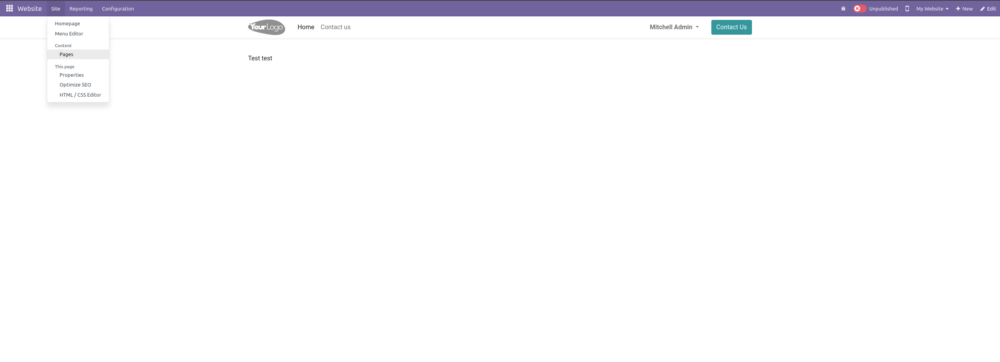
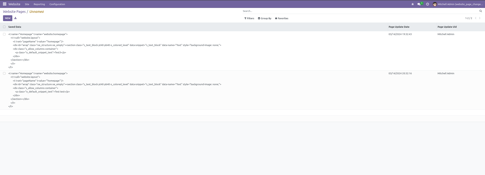

# The module saves all changes made through the website editor.

The module saves all changes made through the website editor and provides an interface for interacting with these changes.

## Instruction

Open the Website section and in the SubMenu, select the Pages section.

## In the opened menu, all website pages are displayed, along with the number of changes made and a button to open the list of changes for the website page.

## Clicking on a change will open a page with the new XML code for the page and additional information.

## Support and Help

If you need help or additional features, please contact us:

Email: george@artlinespb.ru

Website: https://artlinespb.ru/

Contributors

 - ArtLine, maksimov@artline-erp.ru